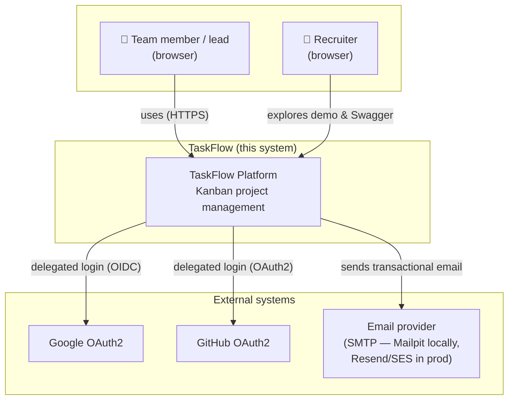
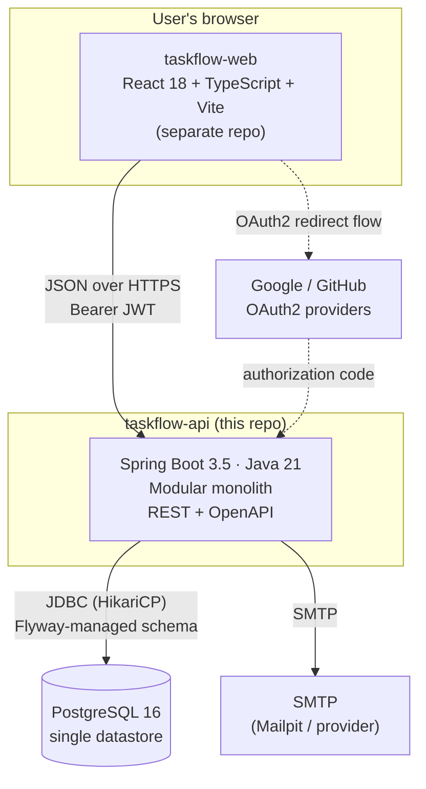
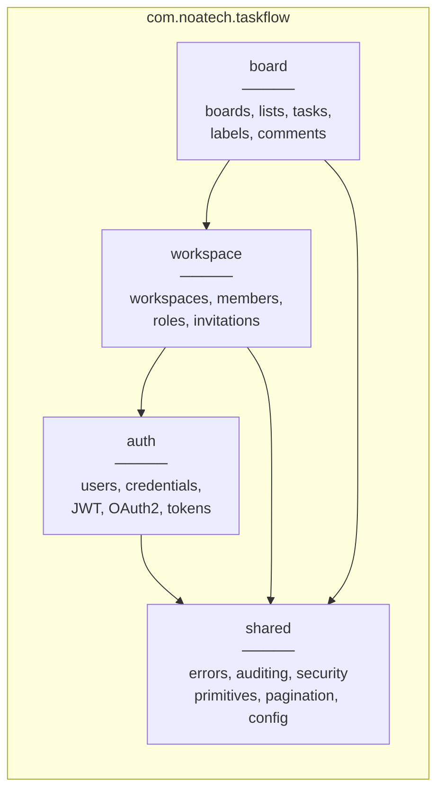

# TaskFlow — Architecture

- **Version:** 1.0
- **Date:** 2026-07-22
- **Author:** Israel Esparza
- **Status:** Draft (pending review)
- **Related:** ADR-002 · ADR-003 · DATA-MODEL.md · SPRINT-PLAN.md

## 1. C4 — Level 1: System Context



## 2. C4 — Level 2: Containers



**Deliberately absent in MVP** (added in later phases, each with an ADR): Redis, message broker, object storage, WebSocket gateway. The diagram will grow — and its Git history will show the evolution.

## 3. Modular Monolith — Module Map



**Dependency rules (enforced by ArchUnit — CARD 1.2):**
1. Arrows may only point right-to-left as drawn: `board → workspace → auth → shared`. Never backwards, never skipping into another module's internals.
2. Each module exposes a small `api` package (public interfaces + DTOs). Everything in `internal` is module-private.
3. Cross-module calls go through the `api` interfaces — today plain method calls; tomorrow, when a module becomes a microservice, the interface becomes an HTTP/gRPC client with minimal blast radius.

### Inside each module (package-by-feature, layered)

```
auth/
├── api/            # public surface for other modules (AuthFacade, CurrentUser)
└── internal/
    ├── web/        # @RestController + request/response DTOs
    ├── application/# services, orchestration, transactions
    ├── domain/     # entities, value objects, domain rules
    └── persistence/# Spring Data repositories
```

**Request flow:** `Controller → ApplicationService → Domain + Repository`, DTOs at the edges, entities never leave the module.

## 4. Cross-Cutting Concerns

| Concern | Approach | Where |
|---------|----------|-------|
| AuthN | Stateless JWT (RS256) filter on every request | `shared.security` + `auth` |
| AuthZ | Role checks at application-service layer; custom `@PreAuthorize` + PermissionEvaluator for workspace-scoped rules | each module |
| Errors | RFC 7807 via global `@RestControllerAdvice` | `shared.errors` |
| Auditing | JPA auditing (`Auditable` base entity) fed by security context | `shared.persistence` |
| Validation | Bean Validation at DTO boundary; domain invariants inside entities | edges + domain |
| Observability | Actuator + Micrometer; JSON logs with correlation ID filter | `shared.observability` |
| API versioning | URL prefix `/api/v1` | web layer |

## 5. Database Evolution Strategy (migration roadmap)

The schema is **never created upfront**. It grows sprint by sprint through hand-written Flyway migrations — each one a deliverable and a challenge (no generators, no `ddl-auto`). Every migration PR must include: the SQL, the matching JPA mappings, and an integration test proving `validate` passes.

| Sprint | Migrations (planned) | Covers |
|--------|---------------------|--------|
| S1 | `V1__extensions_and_users.sql` (citext, pgcrypto, users, audit columns) | CARD 1.4 |
| S2 | `V2__refresh_tokens.sql` · `V3__one_time_tokens.sql` | US-02, US-04 |
| S3 | `V4__oauth_identities.sql` · `V5__auth_rate_limit_support.sql` (if needed) | US-05 |
| S4 | `V6__workspaces_members.sql` (incl. partial unique index for single OWNER) · `V7__invitations.sql` | US-09…13 |
| S5 | `V8__boards_lists.sql` · `V9__tasks.sql` (NUMERIC position) | US-14…18 |
| S6 | `V10__labels_task_labels.sql` · `V11__comments.sql` · `V12__indexes_board_view.sql` (driven by EXPLAIN ANALYZE) | US-17, 19, 21 |

🔥 **Standing DB challenges across sprints:** write every constraint you can push to the DB (CHECKs, partial unique indexes, FK actions) — the DB is the last line of defense; run `EXPLAIN ANALYZE` on every list endpoint before calling it done; keep a `docs/db-notebook.md` with query plans you found interesting (excellent interview stories).

## 6. Environments

| Env | Infra | Purpose |
|-----|-------|---------|
| local | docker compose (api + postgres + mailpit) | development |
| ci | GitHub Actions + Testcontainers | every PR |
| prod | TBD in Sprint 7 (ADR required: Railway vs Fly.io vs VPS) | live demo |

## 7. Architecture Fitness Functions

Automated checks that keep the architecture honest (grow over time):
- ArchUnit: module dependency rules, no `internal` leakage, naming conventions.
- Hibernate statistics assertions: bounded query counts on list endpoints (anti-N+1).
- `flyway validate` + `ddl-auto: validate` in CI: schema and mappings never drift.

## Changelog

| Version | Date | Change |
|---------|------|--------|
| 1.0 | 2026-07-22 | Initial draft — includes DB evolution roadmap |
