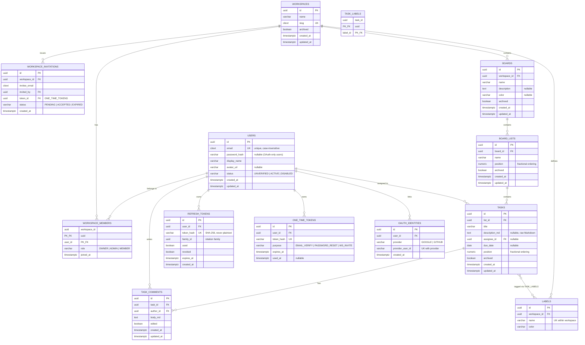

# TaskFlow — Data Model

- **Version:** 1.0
- **Date:** 2026-07-22
- **Author:** Israel Esparza
- **Status:** Draft (pending review)
- **Related:** REQUIREMENTS.md v1.0 · USER-STORIES.md v1.0

## 1. Entity-Relationship Diagram

*(All tables additionally carry `created_by` / `updated_by` audit columns — omitted from the diagram for readability.)*

## 2. Key Design Decisions

### 2.1 UUID primary keys (UUIDv7)
- **What:** All PKs are UUIDs, generated application-side as **UUIDv7** (time-ordered).
- **Why not auto-increment:** IDs appear in URLs; sequential integers leak business volume ("how many users do they have?") and enable enumeration probing. UUIDs also make the future microservice split painless — no ID collisions when data moves between services, and entities can know their ID before hitting the DB (cleaner domain events).
- **Why v7 and not v4:** random v4 UUIDs destroy B-tree index locality (inserts scatter across the index → page splits, cache misses). UUIDv7 is time-prefixed, so inserts are append-mostly like a sequence. Best of both worlds.
- 🔥 *Challenge marker: benchmark insert throughput v4 vs v7 on 1M rows — great blog post material.*

### 2.2 Fractional ordering for lists and tasks
- **What:** `position` is `NUMERIC`, not `INTEGER`. Moving an item = compute midpoint between neighbors = **one row updated**.
- **Alternative rejected:** integer positions require shifting every subsequent row on each move (O(n) writes, lock contention on hot boards).
- **Known trade-off:** midpoints exhaust numeric precision after ~50 consecutive insertions in the same gap → a **rebalance** routine renumbers a list (rare, cheap, done in the same transaction). This is essentially what Trello does (they use string keys; we use NUMERIC for simplicity — both are valid, documented trade-off).

### 2.3 Membership as a first-class join table
- `WORKSPACE_MEMBERS` is not a JPA `@ManyToMany` — it's a real entity with composite PK `(workspace_id, user_id)` plus `role` and `joined_at`. Rule of thumb: **the moment a relationship carries data, model it as an entity.** Also enforces "one membership per user per workspace" at the DB level.
- The **exactly-one-OWNER** invariant is enforced with a partial unique index: `CREATE UNIQUE INDEX ON workspace_members (workspace_id) WHERE role = 'OWNER'` — the database guards the rule even if application code has a bug. 🔥 *This idiom (partial unique index) is a favorite senior-interview topic.*

### 2.4 Tokens: hashed at rest, unified one-time table
- `REFRESH_TOKENS` and `ONE_TIME_TOKENS` store only **SHA-256 hashes**. A DB leak must not hand out valid sessions or reset links. (SHA-256, not BCrypt, is correct here: tokens are high-entropy random strings — brute force is infeasible, so a fast hash is fine. Passwords are low-entropy → slow hash. Understanding *why they differ* matters.)
- One generic `ONE_TIME_TOKENS` table with a `purpose` enum instead of three near-identical tables (email verify / password reset / invitations). Less duplication, single expiry-cleanup job.
- Refresh token **rotation** is modeled with `family_id` + `used` flag: reuse of a `used` token ⇒ revoke whole family (US-04).

### 2.5 Soft delete via `archived` flags — not `deleted_at`
- Boards, lists, tasks are archived (restorable, per US-13/20), never hard-deleted in normal flows. A boolean + partial indexes (`WHERE archived = false`) keeps live-data queries fast.
- Users and comments CAN be hard-deleted (GDPR-style right to erasure); task `assignee_id` uses `ON DELETE SET NULL`, comments use `ON DELETE CASCADE` from tasks.

### 2.6 PostgreSQL specifics
- `citext` extension for emails and slugs → case-insensitive uniqueness without `LOWER()` gymnastics.
- `timestamptz` everywhere; the application always works in UTC.
- Markdown stored **raw**; sanitization happens on output (NFR-05). Storing sanitized HTML would freeze us to today's sanitizer bugs.

### 2.7 Indexing strategy (initial)
- FKs used in list views: `tasks(list_id) WHERE archived = false`, `board_lists(board_id)`, `boards(workspace_id)`, `task_comments(task_id)`.
- Auth hot paths: `users(email)` (via citext UK), `refresh_tokens(token_hash)` UK, `one_time_tokens(token_hash)` UK.
- Board view (US-21) loads via 3 bounded queries: board → lists → tasks-with-labels (batched `IN`), avoiding both N+1 and a mega-join. To be validated with `EXPLAIN ANALYZE` in CARD 5.x.

## 3. Open Questions (to resolve during implementation)

| # | Question | Decide by |
|---|----------|-----------|
| 1 | NUMERIC precision/scale for `position` and exact rebalance threshold | Sprint 5 |
| 2 | Invitation ↔ one_time_token: FK (current) vs embedding token in invitation row | Sprint 4 |
| 3 | Do labels need `position` for consistent display order? | Sprint 5 |

## Changelog

| Version | Date | Change |
|---------|------|--------|
| 1.0 | 2026-07-22 | Initial draft |
